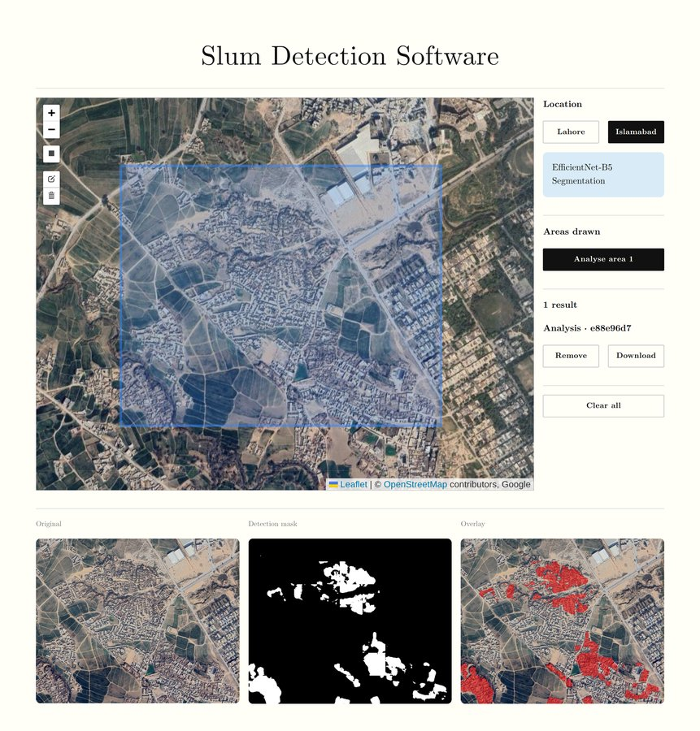

# Slum-i Portal

A Streamlit web app for informal settlement detection in satellite imagery using EfficientNet-B5 segmentation models trained on Lahore and Islamabad.



## How it works

Draw a bounding box on the map, select a city model, and run analysis. The app tiles the selected area, runs segmentation, and overlays detected slum regions on the original imagery.

## Setup

Install a Conda distribution with conda-forge support, such as [Miniforge](https://github.com/conda-forge/miniforge), then create and activate the Python 3.11 environment:

```bash
conda env create --prefix ./.venv --file environment.yml
conda activate ./.venv
python -m streamlit run app.py
```

The environment is stored in `.venv/` inside the repository and is ignored by Git. Run these commands from the repository root. Conda-forge installs GDAL together with its native libraries and Python bindings on Apple Silicon and Linux, so no separate Homebrew GDAL installation is required. TensorFlow is installed into the same environment from its official pip wheel because TensorFlow 2.20 is not available from conda-forge on Apple Silicon. PyArrow also uses its official wheel to avoid a native-library conflict between the conda-forge PyArrow build and TensorFlow on Apple Silicon.

Update an existing environment after dependency changes with:

```bash
conda env update --prefix ./.venv --file environment.yml --prune
```

Model weights (`.h5`) are not included in the repo. Place them in `models/` before running:

- `enb5_seg_lahore.h5`
- `enb5_seg_islamabad.h5`

## Development

Install the managed Git hooks once, then use the Make targets for local checks:

```bash
pre-commit install --install-hooks
make check
```

| Command | Purpose |
| --- | --- |
| `make run` | Start the Streamlit app |
| `make format` | Apply Ruff lint fixes and formatting |
| `make lint` | Check formatting and lint rules without modifying files |
| `make check-text` | Reject em dashes in tracked text files |
| `make typecheck` | Run mypy across the app, benchmark, and tests |
| `make test` | Run the pytest suite |
| `make coverage` | Run tests with terminal and XML coverage reports |
| `make audit` | Audit installed Python packages for known vulnerabilities |
| `make check` | Run linting, type checking, and tests |

Runtime and development dependencies are declared in `environment.yml`. Tool configuration remains in `pyproject.toml`. The benchmark container uses the smaller `benchmarks/environment.yml` environment.

The installed pre-push hook rejects direct pushes to `main`. Both pre-commit and pre-push reject em dashes in tracked text files.
